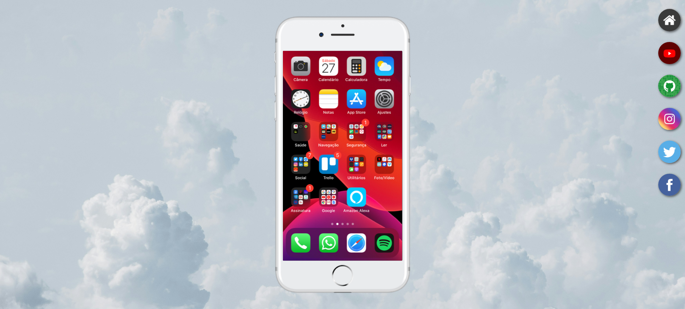
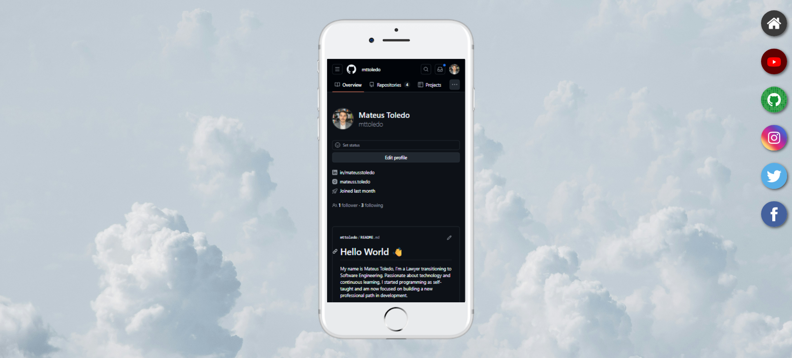

# site-social
Website developed as a project from CursoemVídeo course of Html + CSS

In this project, the iframe resource was used to simulate browse on a mobile device. Additionally, various image and background configurations were explored.

I made some changes to the project, distancing myself from the model proposed by the teacher regarding the wooden background (with all due respect to Professor Gustavo Guanabara's choice, I thought it was really ugly 🤣) and on the GitHub page (I put my personal page there).

## Tradução

Site desenvolvido como projeto do curso de HTML + CSS do CursoemVídeo.

Nesse projeto foi utilizado o recurso iframe para simular uma navegação em aparelho celular. Além disso, foi explorado diversas configurações de imagem e background.

Fiz algumas alterações no projeto, me distanciando do modelo proposto pelo professor quanto ao background de madeira (com todo respeito à escolha do mestre Gustavo Guanabara, achei muito feio 🤣) e na página do GitHub (coloquei minha página pessoal).

## Access Here

<a href="https://professorguanabara.github.io/projeto-social/"> Visit the original project </a>

<a href="https://mttoledo.github.io/site-social/"> Visit my project

## Screenshots

  
  

